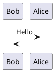

# Structured documents

Sometimes it's useful to have different levels of headings to structure your documents. Start lines with a `#` to create headings. Multiple `##` in a row denote smaller heading sizes.

## This is a second-tier heading

You can use one `#` all the way up to `######` six for different heading sizes.

If you'd like to quote someone, use the > character before the line:

> Coffee. The finest organic suspension ever devised... I beat the Borg with it.
>
> - Captain Janeway

## Text Example

It's very easy to make some words **bold** and other words *italic* with Markdown, or some words ~~srikethrough~~ . You can even [link to Google!](http://google.com)

## List Example

Sometimes you want numbered lists:

1. One
2. Two
3. Three

Sometimes you want bullet points, you can do this with asterisk `*`:

* Start a line with a star
* Profit!

Alternatively dash `-` which is recommended

- Dashes work just as well
- And if you have sub points, put two spaces before the dash or star:
  - Like this
  - And this

## Table Example 


Column A | Column B | Column C
---------|----------|---------
 A1 | B1 | C1
 A2 | B2 | C2
 A3 | B3 | C3

## Image Example

If you want to embed images, this is how you do it:

Remote Images:


Local Images:


## Code Example

There are many different ways to style code with markdown. If you have inline code blocks, wrap them in backticks: `var example = true`.  If you've got a longer block of code, you can indent with four spaces:

    if (isAwesome){
      return true
    }

GitHub Markdown also supports something called code fencing, which allows for multiple lines without indentation:

```
if (isAwesome){
  return true
}
```

And if you'd like to use syntax highlighting with Github Markdown, include the language:

```javascript
if (isAwesome){
  return true
}
```

## Task Lists Example

- [x] @mentions, #refs, [links](), **formatting**, and <del>tags</del> supported
- [x] list syntax required (any unordered or ordered list supported)
- [x] this is a complete item
- [ ] this is an incomplete item

When you include a task list in the first comment of an Issue, you will see a helpful progress bar in your list of issues. It works in Pull Requests, too!

## PlantUML Example

